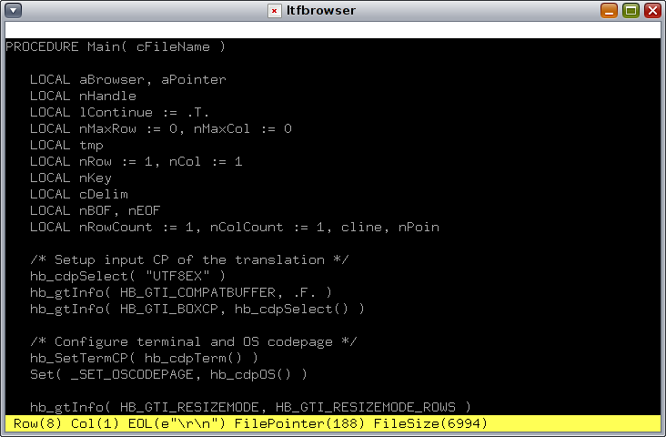

# Large Text File Browser, in short LTFBrowser.

Large Text File Browser, in short LTFBrowser cross-platform, is designed for viewing large text files. It uses little memory and is able to open very large files instantly.

### LTFBrowser live source repository

You'll need Git version control software installed on your system,
and issue this command:

    git clone https://github.com/rjopek/ltfbrowser

You can get subsequent updates using this command:

    git pull

## Oracle Solaris

## License

Licensed under the [MIT](LICENSE) License.